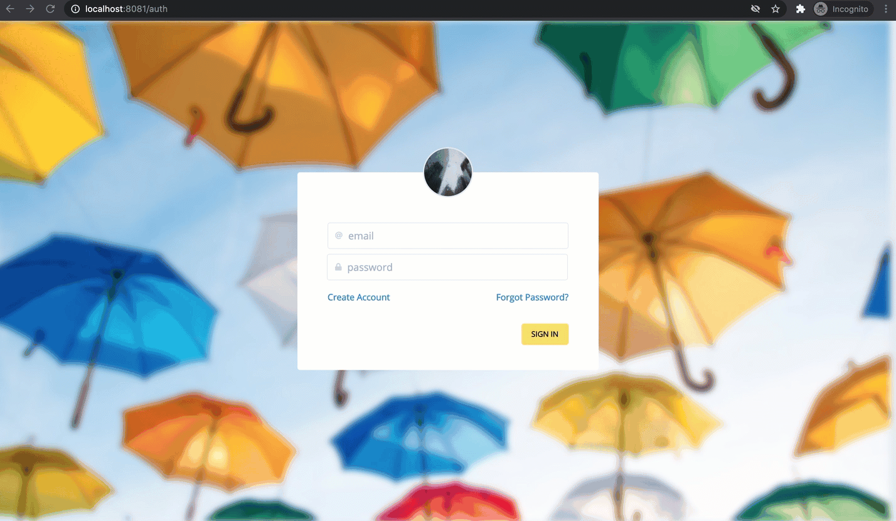

# About this project

Hello again developer pal!, if you have come across this repo on purpose great! thanks for reading, otherwise, maybe you want to take a look at its predecesor [login-vuex-firebase](https://github.com/crisarji/login-vuex-firebase), and if you have a chance, perhaps you can take a look at the post created for it right [here](https://dev.to/crisarji/authentication-with-vue-x-firebase-31dc).

Anyway, let me tell you that this repo is the next step to the authentication, yes, this is for the authorization; it is a simple one using an assigned role for some users by email. I can bet that there are several ways to do it, I wont go to deep cause:
 
 1. Want to give you a sample, you are allowed to fork and reimplement as much as you want/require.
 2. These are my first posts so I am taking it easy.
 3. Any feedback is more than welcome as a PR or thread in the post(I'll be adding the link as soon as I publish it) 

If you checked my aforementioned code and post, you remember we ended up having a functional authentication like this:

<br/>
<p align="center">
  
</p>
<br/>

So far so good!, but what would happen if you want to limitate the access to the users?, depending whether dealing with an `admin` or a `player`(yeap these are the couple roles we could have for this case).

We want to have a way to allow certain views to the `admin` and some others to the `player`, something like this:

<br/>
<h3>Admin</h3>
<p>Allow the access as an administrator to a <strong>dashboard</strong> page, but forbid to access other users page</p>
<p align="center">
  
</p>
<br/>

<br/>
<h3>Player</h3>
<p>Allow the access as a player to a <strong>landing</strong> page, but forbid to access admin pages</p>
<p align="center">
  
</p>
<br/>

## 🚀&nbsp; Installation and Documentation

1. Take an overview of [roles-vuex-firebase](https://github.com/crisarji/roles-vuex-firebase) repo

2. Clone the repo
   ```sh
   git clone git@github.com:crisarji/roles-vuex-firebase.git
   ```
3. Install NPM packages
   ```sh
   npm install
   ```
4. Enter your API from *Firebase* in `firebase.js`
   ```js
   const firebaseConfig = {
      apiKey: 'YOUR_API_KEY',
      authDomain: 'YOUR_AUTH_DOMAIN',
      databaseURL: 'YOUR_DATABASE_URL',
      projectId: 'YOUR_PROJECT_ID',
      storageBucket: 'YOUR_STORAGE_BUCKET',
      messagingSenderId: 'YOUR_MESSAGING_SENDER_ID',
      appId: "YOUR_APP_ID",
      measurementId: "YOUR_MEASUREMENT_ID"
    }; 
   ```
   5. Run the app
   ```sh
   npm run serve
   ```

## ✅&nbsp; Requirements

Here you can find the list of `dependencies` used for this project:

[VueJs 2.6.11](https://vuejs.org/) 
    
[Firebase 7.24.0](https://firebase.google.com/)

[Vuex 3.4.0](https://vuex.vuejs.org/)

[Vue Router 3.2.0](https://router.vuejs.org/)

[Tailwind 1.9.6](https://tailwindcss.com/)

In addition for the `functions` section:

[FirebaseAdmin 9.4.1](https://www.npmjs.com/package/firebase-admin)

[FirebaseFunctions 3.12.0](https://www.npmjs.com/package/firebase-functions)


## 📘&nbsp; License
This repo is released under the under terms of the [MIT License](LICENSE).